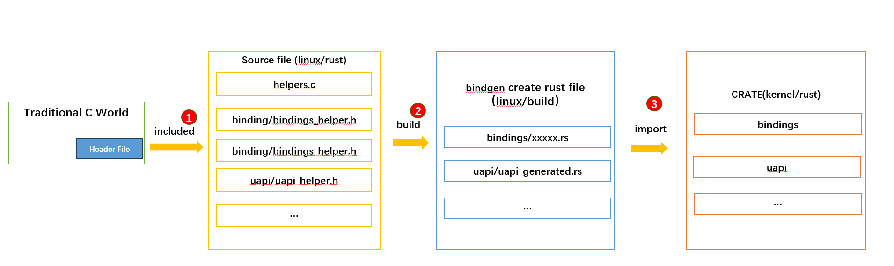

# RUST CALL C 

在RUST基础课程，我们简单介绍过了RUST 如何调用C的代码

首先需要明确C的函数声明形式: 

```
unsigned int mystrlen(char *str);
```

剩下只需要在rust中声明一个C的函数即可，这里必须要考虑类型兼容性

```
extern "C" {
    fn mystrlen(str: *const c_char) -> c_uint;
}
```


### bindgen介绍

[bindgen](https://github.com/rust-lang/rust-bindgen) 
是一个开源的软件 致力于为C (and some C++) 代码库能够自动生成 符合Rust FFI 的 `函数、结构体、宏`等程序项的生成

利用bindgen 只需要输入C语言的源码，可以自动生成对应的 RUST 语言的代码


### 内核实现

下图解释了`r4l`如何利用bindgen 完成在rust中调用内核C代码接口的实现过程 



 - RUST通过crate的形式，承载C的接口调用，每个crate由 `C源文件(包含希望调用的C的接口声明)` 和 `lib.rs（crate 入口）` 组成 
	 - bindings: 源码位于`rust/bindings` 目录，封装还没有在rust实现的模块API  
	 - uapi: 源码位于`rust/uapi` 目录，封装uapi的API
 - bindgen: `rust/Makefile` 会在build阶段，利用上面的C源文件 生成rust源码 
 - crate: 每个crate 的 `lib.rs` 会利用上一步生成的`rs源文件` 组织为 对应的 crate 包


### 使用方法

由于bindings 都是直接暴露的C的API，如果代码中直接调用C的接口，必须通过 `unsafe` 模式使用

当然，再RUST基础课程我们说过，一般不建议程序中直接使用`unsafe`,而是通过封装`unsafe`为安全的接口，再暴露给外部程序使用


