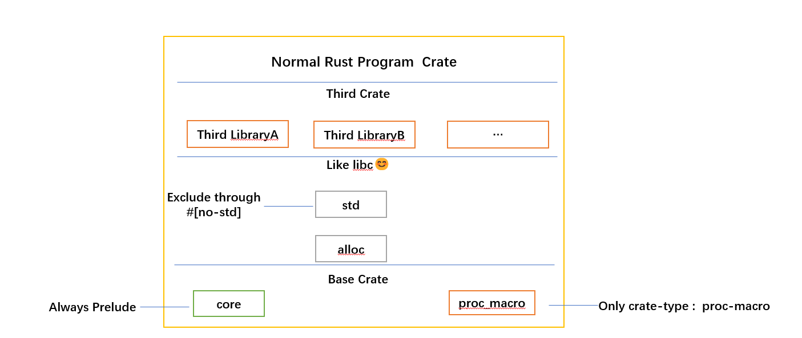
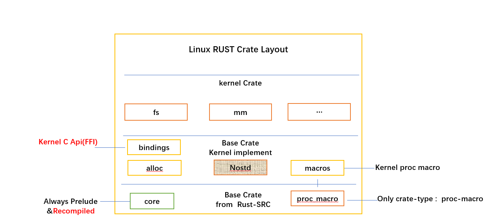
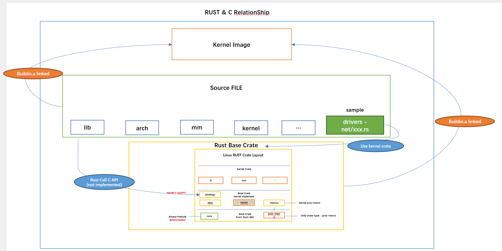

# 整体架构设计

本节，我们试图解释一下目前内核社区的整体架构

### rust基础底座

下图是一个传统的rust 程序的依赖，大部分时候，RUST 会利用预加载模块集/预导入包的形式加载一些基础库

但是，很明显，内核开发其实并不能也不应该使用 std 库中的类型和方法(不可能在内核中调用glibc的接口)

因此，内核需要重新组织自己和封装自己的基础库, 甚至需要重新编译`core`基础库

### 内核和RUST关系

下图从构建和调用关系尝试描述RUST 未来和当前的情况

